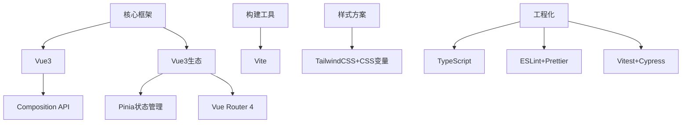
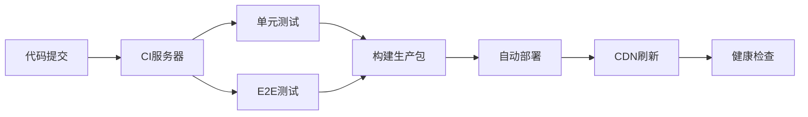

本文介绍如何从 0 到 1 构建一个完整的 Vue3 工程项目。以下是经过实战验证的完整流程和关键决策点：

### 一、架构设计阶段

1. **技术选型矩阵**



2. **目录结构设计**

```
src/
├─ assets/           # 静态资源
├─ components/       # 通用组件
│  └─ base/          # 基础UI组件
├─ composables/      # 组合式函数
├─ layouts/          # 页面布局
├─ router/           # 路由配置
├─ stores/           # Pinia状态管理
├─ styles/           # 全局样式
│  ├─ variables.scss # 设计系统变量
│  └─ index.scss     # 全局样式入口
├─ types/            # TS类型定义
├─ utils/            # 工具函数
├─ views/            # 页面组件
├─ App.vue           # 根组件
└─ main.ts           # 应用入口
```

### 二、工程初始化

1. **Vite 脚手架**

```bash
npm create vite@latest my-project -- --template vue-ts
```

2. **关键依赖**

```bash
npm install pinia vue-router@4
npm install -D sass vitest @vitejs/plugin-vue-jsx
npm install -D @types/node # 解决路径别名类型问题
```

### 三、核心模块实现

1. **Vue3 最佳实践**

```ts
// composables/useUserData.ts
import { ref, computed } from "vue";

export default function useUserData() {
  const user = ref<User | null>(null);

  const isAdmin = computed(() => user.value?.role === "admin");

  const fetchUser = async (id: string) => {
    user.value = await api.getUser(id);
  };

  return { user, isAdmin, fetchUser };
}
```

2. **Pinia 状态管理**

```ts
// stores/useCartStore.ts
import { defineStore } from "pinia";

export const useCartStore = defineStore("cart", {
  state: () => ({
    items: [] as CartItem[],
  }),
  actions: {
    addItem(item: CartItem) {
      const existing = this.items.find((i) => i.id === item.id);
      existing
        ? existing.quantity++
        : this.items.push({ ...item, quantity: 1 });
    },
    // 持久化示例
    hydrate() {
      const saved = localStorage.getItem("cart");
      if (saved) this.items = JSON.parse(saved);
    },
  },
  getters: {
    totalItems: (state) =>
      state.items.reduce((sum, item) => sum + item.quantity, 0),
    totalPrice: (state) =>
      state.items.reduce((sum, item) => sum + item.price * item.quantity, 0),
  },
});
```

### 四、工程化配置

1. **Vite 深度配置**

```ts
// vite.config.ts
export default defineConfig({
  plugins: [vue(), vueJsx()],
  resolve: {
    alias: {
      "@": path.resolve(__dirname, "./src"),
      "#types": path.resolve(__dirname, "./types"),
    },
  },
  build: {
    rollupOptions: {
      output: {
        manualChunks: {
          vendor: ["vue", "pinia", "axios"],
          ui: ["element-plus", "vant"],
        },
      },
    },
  },
});
```

2. **自动化代码质量**

```json
// .eslintrc
{
  "extends": [
    "plugin:vue/vue3-recommended",
    "airbnb-typescript/base",
    "prettier"
  ],
  "rules": {
    "vue/multi-word-component-names": "off",
    "import/prefer-default-export": "off"
  }
}
```

### 五、性能优化策略

1. **代码分割方案**

```ts
// router/index.ts
const ProductDetail = () => import("@/views/ProductDetail.vue");

const routes = [
  {
    path: "/product/:id",
    component: ProductDetail,
    meta: { preload: true }, // 自定义预加载标识
  },
];
```

2. **智能预加载**

```ts
// main.ts
router.beforeEach((to, from, next) => {
  if (to.meta.preload) {
    const component = to.matched[0]?.components?.default;
    if (typeof component === "function") component();
  }
  next();
});
```

3. **静态资源优化**

```html
<!-- 响应式图片 -->
<picture>
  <source srcset="@/assets/banner.avif" type="image/avif" />
  <source srcset="@/assets/banner.webp" type="image/webp" />
  
</picture>
```

### 六、安全加固

1. **XSS 防护**

```ts
// directives/safeHtml.ts
import { Directive } from "vue";

const safeHtml: Directive = {
  mounted(el, binding) {
    el.innerHTML = DOMPurify.sanitize(binding.value, {
      ALLOWED_TAGS: ["b", "i", "em", "strong"],
      FORBID_ATTR: ["style", "onclick"],
    });
  },
};
```

2. **API 安全**

```ts
// utils/request.ts
const service = axios.create({
  baseURL: import.meta.env.VITE_API_URL,
  timeout: 15000,
  withCredentials: true, // 携带cookie
});

// CSRF Token处理
service.interceptors.request.use((config) => {
  const token = Cookies.get("XSRF-TOKEN");
  if (token) {
    config.headers["X-XSRF-TOKEN"] = token;
  }
  return config;
});
```

### 七、部署流水线



### 八、进阶实践

1. **微前端集成**

```ts
// 主应用
import { loadMicroApp } from "qiankun";

const productApp = loadMicroApp({
  name: "product-module",
  entry: "//product.example.com",
  container: "#product-container",
  props: { user: currentUser },
});
```

2. **性能监控**

```ts
// 使用Performance API
const perfObserver = new PerformanceObserver((list) => {
  list.getEntries().forEach((entry) => {
    if (entry.name === "first-contentful-paint") {
      analytics.track("FCP", { value: entry.startTime });
    }
  });
});
perfObserver.observe({ type: "paint", buffered: true });
```

### 关键决策点

1. **Composition API vs Options API**

   - 复杂业务选择 Composition API（逻辑复用性强）
   - 简单组件可用 Options API（降低学习成本）

2. **状态管理选择**

   ```mermaid
   pie
       title 状态管理方案选择
       “Pinia” ： 65
       “Vuex 4” ： 25
       “无状态管理” ： 10
   ```

3. **CSS 方案对比**
   | 方案 | 适用场景 | 维护成本 |
   |---------------|-----------------------|---------|
   | CSS Modules | 组件级别样式隔离 | 低 |
   | Tailwind | 快速原型/设计系统统一 | 中 |
   | CSS-in-JS | 动态主题/复杂交互 | 高 |

### 避坑指南

1. **响应式丢失问题**

```ts
// 错误示例
const state = reactive({ items: [] });
state.items = await fetchItems(); // 响应式丢失！

// 正确做法
state.items = reactive(await fetchItems());
// 或
Object.assign(state, { items: await fetchItems() });
```

2. **内存泄漏防范**

```ts
onBeforeUnmount(() => {
  eventBus.off("custom-event", handler);
  clearInterval(timer);
  observer.disconnect();
});
```

3. **SSR 兼容性**

```ts
// 客户端特定代码
if (typeof window !== "undefined") {
  const analytics = import("analytics-lib");
}
```

### 项目演进建议

1. **渐进式类型增强**

   - 阶段 1：允许`any`但开启`noImplicitAny`
   - 阶段 2：开启`strictNullChecks`
   - 阶段 3：开启`strictFunctionTypes`

2. **架构演进路径**
   ```
   单仓库 → 多包管理 → 微前端 → BFF层 → 全栈式
   ```

构建完整的 Vue3 工程需要平衡技术先进性和团队能力，核心原则：

- **可维护性**：组件原子化设计
- **可扩展性**：插件式架构
- **稳定性**：渐进式升级策略
- **性能基线**：Lighthouse 评分>90
- **开发体验**：HMR 热更新<500ms

最终工程应具备：类型安全的前端、自动化质量门禁、可观测的运行监控、无痛升级的依赖管理。
